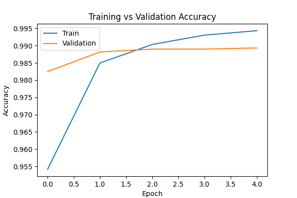
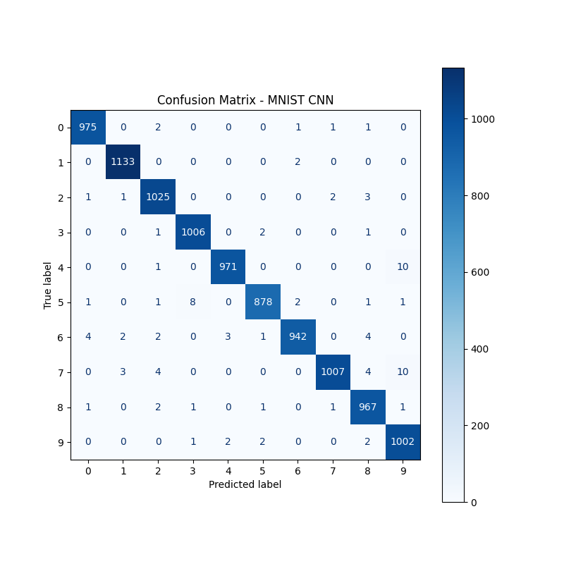
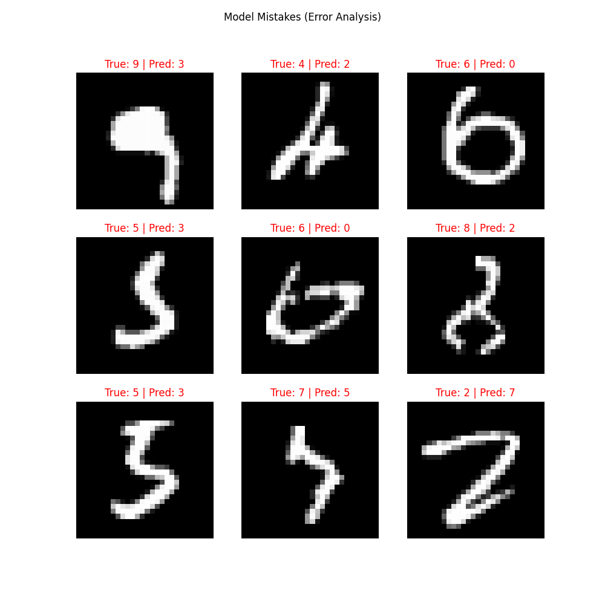

# Handwritten Digit Recognition using CNN (MNIST)

This project implements a Convolutional Neural Network (CNN) to recognize handwritten digits from the MNIST dataset with a final test accuracy of **99.06%**.

## 📊 Project Results
* **Final Test Accuracy:** 99.06%
* **Training Accuracy:** 99.49%
* **Validation Accuracy:** 98.93%

### 📈 Training History
*(This chart shows how the accuracy improved during training).*

### 📊 Confusion Matrix
*(This matrix displays where the model predicted correctly and where it got confused).*

### ❌ Error Analysis (Model Mistakes)
*(Here are 9 examples of handwritten digits the model incorrectly classified).*

